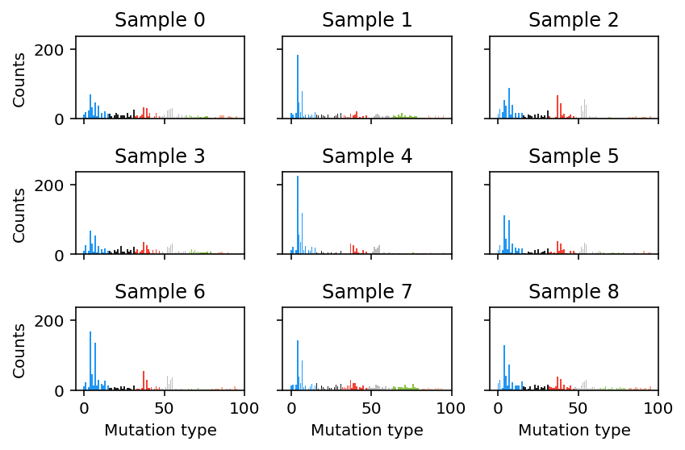

=========
Tutorials
=========

Getting started
===============

TensorSignatures deciphers mutational signatures in context transcription,
replication and arbitrary genomic environments, which is achieved by partitioning
single nucleotide variants (SNVs) to different states dependent on their
genomic location, and representing this data in a multidimensional array (tensor).
Additionally, the algorithm takes a secondary mutation matrix as input to link
other variant types to these signatures by sharing their exposure. In the following
tutorial, we want to convey an intutition for working with such highdimensional
data and explain the usage of the :code:`tensorsignatures` API and command line
interface by

1. simulating data set
2. running Tensorsignatures
3. exploring inferred parameters.

Creating sample data with :code:`TensorSignatureData` using the API
-------------------------------------------------------------------

The :code:`tensorsignatures.data` module provides the :obj:`TensorSignatureData`
class allowing us to create simulated data, which we will explore in the
following to understand the meaning of various parameters of the model. To
create such data, we load the module and initalize :obj:`TensorSignatureData`
object

>>> import tensorsignatures as ts
>>> data_set = ts.TensorSignatureData(seed=573, rank=3, samples=100, dimensions=[3, 5], mutations=1000)

which will create a dataset comprising 100 cancer genomes (:code:`samples`)
exposed to three signatures (:code:`rank`) each with 1000 mutations. By passing
the list :code:`[3, 5]` to the :code:`dimension` argument, we create two additional
genomic dimensions with size 3 and 5 respectively. To obtain the SNV count tensor,
we invoke the :code:`snv` method of :code:`data_set`, which returns a
multidimensional array.

>>> snv = data_set.snv()
>>> snv.shape
(3, 3, 3, 5, 96, 100)

The shape attribute of the :code:`snv` object is tuple of :code:`int` s indicating
the size of the array in each dimension. TensorSignatures expects input data to follow
a specific structure which is explained in the following table.

+-------------------------+-----------+-----------+---------------------------+
| Dimension               | Size      | Index     | Data                      |
+-------------------------+-----------+-----------+---------------------------+
| Transcription           | :code:`3` | :code:`0` | Coding strand mutations   |
| (:code:`snv.shape[0]`)  |           +-----------+---------------------------+
|                         |           | :code:`1` | Template strand mutations |
|                         |           +-----------+---------------------------+
|                         |           | :code:`2` | Unassigned mutations      |
+-------------------------+-----------+-----------+---------------------------+
| Replication             | :code:`3` | :code:`0` | Leading strand mutations  |
| (:code:`snv.shape[1]`)  |           +-----------+---------------------------+
|                         |           | :code:`1` | Lagging strand mutations  |
|                         |           +-----------+---------------------------+
|                         |           | :code:`2` | Unassigned mutations      |
+-------------------------+-----------+-----------+---------------------------+
| First genomic aribtrary |:code:`t+1`| :code:`0` | Unassigned mutations      |
| dimension (eg. epigenetic|           +-----------+---------------------------+
| environments)           |           | :code:`1` | Genomic state 1 mutations |
|                         |           +-----------+---------------------------+
| (:code:`snv.shape[2]`)  |           | ...       |                           |
|                         |           +-----------+---------------------------+
|                         |           | :code:`t` | Genomic state t mutations |
+-------------------------+-----------+-----------+---------------------------+
| Last arbitrary genomic  |:code:`r+1`| :code:`0` | Unassigned mutations      |
| dimension (eg. nucleosomal|           +-----------+---------------------------+
| states)                 |           | :code:`1` | Genomic state 1 mutations |
|                         |           +-----------+---------------------------+
| (:code:`snv.shape[-3]`) |           | ...       |                           |
|                         |           +-----------+---------------------------+
|                         |           | :code:`r` | Genomic state r mutations |
+-------------------------+-----------+-----------+---------------------------+
| Base substitution types | p=        | :code:`0` | A[C>A]A                   |
|                         | :code:`96`+-----------+---------------------------+
| (:code:`snv.shape[-2]`) |           | :code:`1` | A[C>A]C                   |
|                         |           +-----------+---------------------------+
|                         |           | ...       |                           |
|                         |           +-----------+---------------------------+
|                         |           | :code:`p` | T[T>C]T                   |
+-------------------------+-----------+-----------+---------------------------+
| Samples                 | :code:`n` | :code:`0` | Sample 1                  |
|                         |           +-----------+---------------------------+
| (:code:`snv.shape[-1]`) |           | ...       |                           |
|                         |           +-----------+---------------------------+
|                         |           | :code:`n` | Sample n                  |
+-------------------------+-----------+-----------+---------------------------+

From this we can see that our simulated :code:`data_set` contains two additional
genomic dimensions with size 3 and 5 respectively. Note, that we can reconstruct
the mutational spectra in each genomic dimension by summing over respective
dimension. For example, to reconstruct the :math:`p\times n` mutation
count matrix, which serves as an input for conventional mutational signature
analysis, we could sum over all dimensions except the last two. The following
code illustrates this operation.

>>> snv_collapsed = snv.sum(axis=(0, 1, 2,)) # snv_collapsed.shape == (96, 100)
>>> fig, axes = plt.subplots(3, 3, sharey=True, sharex=True)
>>> for i, ax in enumerate(np.ravel(axes)):
>>>     ax.bar(np.arange(96), snv_collapsed[:, i], color=ts.DARK_PALETTE, edgecolor="None")
>>>     ax.set_title('Sample {}'.format(i))
>>> plt.tight_layout()

However, by first selecting a specific states and then summing over the
remaining tensor, we can reveal changes across different genomic dimensions
or states. Take transcription for example,

Plotting the trinucleotide profile of the first samples reveals that samples
are dominated by C>A (blue) and T>C (green). To understand this, we can plot
the underlying signatures for the dataset by executing

>>> plt.figure(figsize=(12, 2))
>>> ts.plot_signatures(d.S, width=0.4)

.. figure::  images/signatures.png
   :align:   center

which illustrates that shown samples above are a superposition of both signatures.

Running TensorSignatures on example data
========================================

To use tensorsignatures in a project::

    import tensorsignatures
