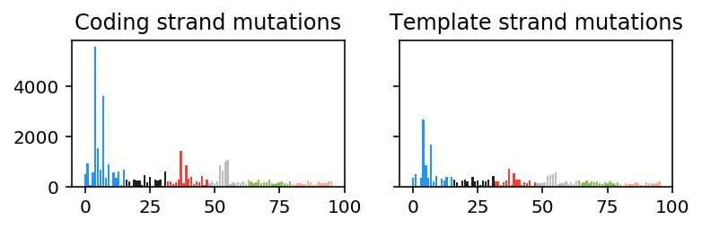
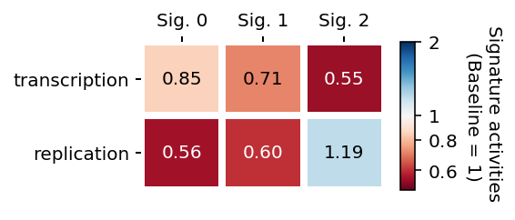
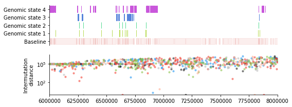
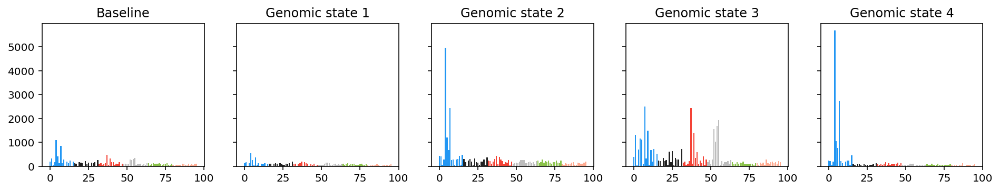
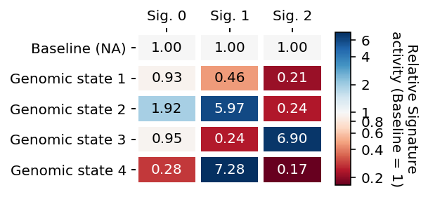
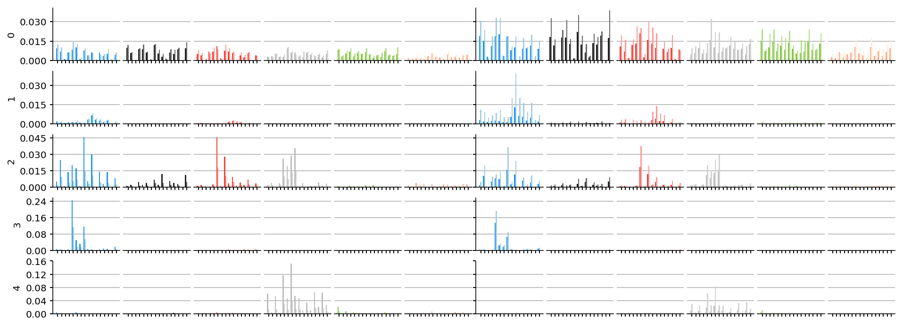

=========
Tutorials
=========

Understanding the SNV count tensor
==================================

TensorSignatures deciphers mutational signatures in context transcription,
replication and arbitrary genomic environments, which is achieved by partitioning
single nucleotide variants (SNVs) to different states dependent on their
genomic location, and representing this data in a multidimensional array (tensor).
Additionally, the algorithm takes a secondary mutation matrix as input to link
other variant types to these signatures by sharing their exposure. In the following
tutorial, we want to convey an intutition for working with such highdimensional
data and explain the usage of the :code:`tensorsignatures` API and command line
interface by

1. simulating data set
2. running Tensorsignatures
3. exploring inferred parameters.

Creating sample data with :code:`TensorSignatureData`
-----------------------------------------------------

The :code:`tensorsignatures.data` module provides the :obj:`TensorSignatureData`
class allowing us to create simulated data, which we will explore in the
following to understand the meaning of various parameters of the model. To
create such data, we load the module and initalize :obj:`TensorSignatureData`
object

>>> import tensorsignatures as ts
>>> data_set = ts.TensorSignatureData(seed=573, rank=3, samples=100, dimensions=[3, 5], mutations=1000)

which will create a dataset comprising 100 cancer genomes (:code:`samples`)
exposed to three signatures (:code:`rank`) each with 1000 mutations. By passing
the list :code:`[3, 5]` to the :code:`dimension` argument, we create two additional
genomic dimensions with size 3 and 5 respectively. To obtain the SNV count tensor,
we invoke the :code:`snv` method of :code:`data_set`, which returns a
multidimensional array.

>>> snv = data_set.snv()
>>> snv.shape
(3, 3, 3, 5, 96, 100)

The shape attribute of the :code:`snv` object is tuple of :code:`int` s indicating
the size of the array in each dimension. TensorSignatures expects input data to follow
a specific structure which is explained in the following table.

+----------------------------+-----------+-----------+---------------------------+
| Dimension                  | Size      | Index     | Data                      |
+----------------------------+-----------+-----------+---------------------------+
| Transcription              | :code:`3` | :code:`0` | Coding strand mutations   |
|                            |           +-----------+---------------------------+
| (:code:`snv.shape[0]`)     |           | :code:`1` | Template strand mutations |
|                            |           +-----------+---------------------------+
|                            |           | :code:`2` | Unassigned mutations      |
+----------------------------+-----------+-----------+---------------------------+
| Replication                | :code:`3` | :code:`0` | Leading strand mutations  |
|                            |           +-----------+---------------------------+
| (:code:`snv.shape[1]`)     |           | :code:`1` | Lagging strand mutations  |
|                            |           +-----------+---------------------------+
|                            |           | :code:`2` | Unassigned mutations      |
+----------------------------+-----------+-----------+---------------------------+
| First aribtrary genomic    |:code:`t+1`| :code:`0` | Unassigned mutations      |
| dimension                  |           +-----------+---------------------------+
|                            |           | :code:`1` | Genomic state 1 mutations |
| (eg. epigenetic states)    |           +-----------+---------------------------+
|                            |           | ...       |                           |
|                            |           +-----------+---------------------------+
| (:code:`snv.shape[2]`)     |           | :code:`t` | Genomic state t mutations |
+----------------------------+-----------+-----------+---------------------------+
| Last arbitrary genomic     |:code:`r+1`| :code:`0` | Unassigned mutations      |
| dimension                  |           +-----------+---------------------------+
|                            |           | :code:`1` | Genomic state 1 mutations |
| (eg. nucleosomal states)   |           +-----------+---------------------------+
|                            |           | ...       |                           |
|                            |           +-----------+---------------------------+
| (:code:`snv.shape[-3]`)    |           | :code:`r` | Genomic state r mutations |
+----------------------------+-----------+-----------+---------------------------+
| Base substitution types    | p=        | :code:`0` | A[C>A]A                   |
|                            | :code:`96`+-----------+---------------------------+
| (:code:`snv.shape[-2]`)    |           | :code:`1` | A[C>A]C                   |
|                            |           +-----------+---------------------------+
|                            |           | ...       |                           |
|                            |           +-----------+---------------------------+
|                            |           | :code:`p` | T[T>C]T                   |
+----------------------------+-----------+-----------+---------------------------+
| Samples                    | :code:`n` | :code:`0` | Sample 1                  |
|                            |           +-----------+---------------------------+
| (:code:`snv.shape[-1]`)    |           | ...       |                           |
|                            |           +-----------+---------------------------+
|                            |           | :code:`n` | Sample n                  |
+----------------------------+-----------+-----------+---------------------------+

From this we can see that our simulated :code:`data_set` contains two additional
genomic dimensions with size 3 and 5 respectively. We can index the SNV tensor like 
any other numpy array. For example, to obtain template and leading strand mutations 
from "unassigned" genomic regions, we would simply index the tensor with 
:code:`snv[0, 1, 0, 0, :, :]` which returns a two dimensional array with mutation 
types along the first axis and samples along the other.

Note, that we can reconstruct the :math:`p\times n` mutation count matrix, which
usually serves as an input for conventional mutational signature analysis, by summing
over all dimensions except the last two (representing base substitution types
and samples respectively). The following code illustrates this operation.

>>> snv_collapsed = snv.sum(axis=(0,1,2,3,))

To inspect the mutational spectra of the first 9 samples we excecute.

>>> import matplotlib.pyplot as plt
>>> fig, axes = plt.subplots(3, 3, sharey=True, sharex=True)
>>> for i, ax in enumerate(np.ravel(axes)):
>>>    ax.bar(np.arange(96), snv_collapsed[:, i], color=ts.DARK_PALETTE)
>>>    ax.set_title('Sample {}'.format(i))
>>>    if i%3==0: ax.set_ylabel('Counts')
>>>    if i>=6: ax.set_xlabel('Mutation type')

.. figure::  images/samples.png
   :align:   center

However, by first selecting a specific states and then summing over all
remaining dimensions, we can reveal changes across different genomic dimensions
or states. For example, to get all coding and template strand mutations of the
dataset we could compute

>>> snv_coding = snv[0,].sum(axis=(0,1,2,4))
>>> snv_template = snv[1,].sum(axis=(0,1,2,4))

and then inspect both spectra by

>>> fig, axes = plt.subplots(1, 2, sharey=True)
>>> axes[0].bar(np.arange(96), snv_coding, color=ts.DARK_PALETTE)
>>> axes[0].set_title('Coding strand mutations')
>>> axes[1].bar(np.arange(96), snv_template, color=ts.DARK_PALETTE)
>>> axes[1].set_title('Template strand mutations')

which reveals that especially C>A (blue), C>T (red) and T>A (grey) mutations
are more prevalent on coding strand DNA.

By indexing the the SNV tensor appropriately we can also recover mutational
spectra from different state combinations, eg. :code:`snv[0,:,2].sum(axis=(0,1))`
would return a :math:`p\times n` matrix representing the coding strand
mutations in state 2 of the first additional genomic dimension.

To summarize, in this section we created a simulated SNV tensor using the
:obj:`tensorsignatures.util.TensorSignatureData` class. TensorSignatures features
the characterization of mutational processes across an arbitrary number of
genomic dimensions and states, but requires the user structure their input array in
specified manner. The SNV count tensor must contain transcriptional and
replicational variants in the first two dimension, and specify base substitutions
as well as samples in the last two dimensions. To recover mutational spectra
in specific contexts, the SNV count tensor has to be indexed and summed over
all remaining dimensions (except the ones containing base substitutions and
samples).

Understanding transcriptional and replicational biases
------------------------------------------------------

In the previous section, we created a example dataset using the
:obj:`TensorSignaturesData` object and investigated the data by plotting
mutational spectra in various genomic contexts. While doing this, we discovered
that some variant types seem to occur with higher frequency on conding strand
DNA as compared to their equivalents on template DNA. Such phenomena have been
observed in several mutational processes and are, for example, attributed to DNA
repair mechanisms such as transcription coupled repair (TCR), which actively
depletes mutations gene encoding regions.

TensorSignatures models variability in mutagenesis due to transcription and
replication by

1. extracting separate mutational spectra for coding and template strand DNA, and lead and lagging strand DNA
2. fitting a scalar for each signature that quantifies the overall shift of mutations in pyrimidine context (bias matrix :code:`b`)
3. fitting a scalar for each signature that is interpreted as the relative signature activity of signature in transcribed vs untranscribed regions, and early and late replicating regions (activity matrix :code:`a`).

To understand this, we can plot the signatures that created the 
simulated counts in :code:`snv` by

>>> plt.figure(figsize=(16, 3))
>>> ts.plot_signatures(data_set.S.reshape(3,3,-1,96,3))

.. figure::  images/signatures.png
   :align:   center
   :height: 150px

which reveals the SNV spectra of three signatures (rows) for transcription and
replication in the left and right column. In this representation colors indicate 
the mutation type (blue C>A, black C>G, red C>T, grey T>A, green
T>C and salmon T>G), while shading indicates the mutation type probabilities for 
coding strand and leading strand DNA (dark), and for template and lagging strand DNA 
(light), respectively. Notice, how in the first signature (second row) dark blue bars 
are larger in comparison to accompanying light blue bars, indicative for the fact that
this mutational process is more likely to produce C>A mutations on coding and leading 
strand mutations.

Rather than investigating strand biases on mutation type level, it may be desireable 
to obtain an point estimate that quantifies the overall propensity of each mutational 
process to generate strand specific mutations. To accomplish this, TensorSignatures 
fits two (for transcription and replication) scalar variables for each extracted signature
that scale trinucleotide spectra by the amount of the detected strand asymmetry. 
We can employ the :code:`ts.heatmap` function to visualize them for our simulated data set.

>>> plt.figure(figsize=(6,3))
>>> ts.heatmap(np.exp(data_set.b0), 
           vmin=.5, vmax=2, # allows to specify the limits of the colorbar
           row_labels=['transcription', 'replication'],
           col_labels=['Signature {}'.format(i) for i in range(3)],
           cbarlabel='Strand bias (No bias = 1)' # color bar label
          )

.. figure::  images/strand_biases.png
   :align:   center
   :height: 150px

   *Transcriptional and Replicational strand biases for each mutational signature of the simulated dataset.*

Rows display the context and columns repspective signatures. Note the logarithmic scaling 
of the colorbar which indicates that a baseline value of 1 resembles a mutational process 
with no strand preference.

Signature activities on transcribed/untranscribed and early/late replicating genomic regions
--------------------------------------------------------------------------------------------

In addition to strand biases, TensorSignatures evaluates the activity of signatures in
transcribed vs. untranscribed and early vs. late replicating regions. To visualize the
these coefficients for our artificial dataset, we again make use of the :code:`ts.heatmap`
function

>>> plt.figure(figsize=(6,3))
>>> ts.heatmap(np.exp(data_set.a0), 
           vmin=.5, vmax=2, # allows to specify the limits of the colorbar
           row_labels=['transcription', 'replication'],
           col_labels=['Signature {}'.format(i) for i in range(3)],
           cbarlabel='Signature activities (Baseline = 1)' # color bar label
          )

The interpretation of this plot is as follows: A baseline value of 1 indicates that there is
no difference in signature activity between transcribed and untranscribed, or early and late
replicating regions. Values < 1 indicate a larger activity of the mutational process in untranscribed
or late replicating regions, while coefficients > 1 imply the opposite; an enhanced activity
in transcribed or early replicating regions.

Signature activities in specific genomic regions
------------------------------------------------

The multidimensional representation of SNV count data allows TensorSignatures to quantify the propensity of
mutational processes within confined genomic regions. These genomic contexts, thereafter also genomic states, 
can represent genomic features such as specific chromatin marks or nucleosome occupancy. To illustrate this,
we depicted a genomic region in the figure below together with arbitrary genomic states
and respective mutations from pooled cancer genomes.  

   
   *Illustration of genomic states which represent confined genomic regions with certain features.*

The rainfall plot representation may not always reveal changes in the mutational spectrum on first sight. 
However, the SNV count tensor contains the mutational spectra of each state combination. We can inspect 
them by indexing the respective state and summing over all remaining dimensions except the one for
trinucleotides. To visualize the mutational spectra along the five states of the fourth dimension of
our simulated dataset we would type

>>> fig, ax = plt.subplots(1, 5, figsize=(16, 2.5), sharey=True)
>>> ax[0].bar(np.arange(96), snv[:,:,:,0].sum(axis=(0,1,2,4)), color=ts.DARK_PALETTE)
>>> ax[0].set_title('Baseline')
>>> ax[1].bar(np.arange(96), snv[:,:,:,1].sum(axis=(0,1,2,4)), color=ts.DARK_PALETTE)
>>> ax[1].set_title('Genomic state 1')
>>> ax[2].bar(np.arange(96), snv[:,:,:,2].sum(axis=(0,1,2,4)), color=ts.DARK_PALETTE)
>>> ax[2].set_title('Genomic state 2')
>>> ax[3].bar(np.arange(96), snv[:,:,:,3].sum(axis=(0,1,2,4)), color=ts.DARK_PALETTE)
>>> ax[3].set_title('Genomic state 3')
>>> ax[4].bar(np.arange(96), snv[:,:,:,4].sum(axis=(0,1,2,4)), color=ts.DARK_PALETTE)
>>> ax[4].set_title('Genomic state 4')

   *Pooled SNV spectra across the fourth dimension of the SNV count tensor.*

This plot illustrates the fact that different genomic states may have variable signature exposuers. For
example, Genomic state 2 and 4 are clearly dominated by signature 1 as judged by the strong prevalence
of C>A mutations (blue).

Tensorsignatures models the activity of each signature by fitting a single coefficient for
each signature and genomic state. To visualize the coefficients used to generate our simulated dataset 
we execute

>>> plt.figure(figsize=(3,2))
>>> ts.heatmap(data_set.K['k1'].reshape(-1, data_set.rank),
           row_labels=['Baseline (NA)', 'Genomic state 1', 'Genomic state 2', 'Genomic state 3', 'Genomic state 4'],
           col_labels=['Sig. {}'.format(i) for i in range(3)],
           cbarlabel='Relative Signature\nactivity (Baseline = 1)' # color bar label
          ) 

   *Relative signature activities across states of the fourth dimension of the SNV count tensor.*

confirming our first impression that signature 1 shows strongest activity genomic state 2 and 4. To interprete
this correctly, keep in mind that usually majority of SNVs do not fall into specific genomic states 
and therefore end up in the baseline state, which is in Tensorsignatures always 1, and to which all other coefficients 
are inferred relatively to. In other words, signature 1 shows 6x and 7x higher activities in genomic state 
2 and 4 in comparison to the genomic baseline.

Running TensorSignatures on example data via CLI
================================================

In this tutorial we will first simulate SNV and other mutation count data, and subsequently run 
TensorSignatures on this data via the commandline interface (CLI). The goal is to illustrate how to run
TensorSignatures in a practical setting.

To create a reproducable (the first positional argument sets a seed: :code:`573`) synthetic dataset from 
5 mutational signatures (second positional argument) with the CLI, we invoke the :code:`data` subprogram

::
    
    $ tensorsignatures data 573 5 data.h5 -s 100 -m 1000 -d 6 -d 4

which will simulate 100 samples (:code:`-s 1000`) with 1000 mutations each (:code:`-m 1000`), and 
two additional dimensions with 6 and 4 genomic states (:code:`-d 6 -d 4`). The program writes a :code:`hdf5` file
:code:`data.h5` into the current folder containing the dataset :code:`SNV` and :code:`OTHER` representing
the SNV count tensor and all other variant types respectively.

Since we know the number of signatures that made up the dataset we can run tensorsignatures
simply by executing

::

    $ tensorsignatures --verbose train data.h5 my_first_run.pkl 5

which create pickle able file, that we can load into a interactive python session (eg. a Jupyter notebook) 
for further investigation.

Analysing a tensorsignature initialization
------------------------------------------

To analyse the initialization we generated in the previous section, we recommend to spin up a
jupyter notebook and start by importing some useful libraries.

>>> import tensorsignatures as ts
>>> import numpy as np
>>> import matplotlib.pyplot as plt
>>> %matplotlib inline

The :code:`ts.load_dump` function allows the load the generated :code:`pkl` file into our session.

>>> init = ts.load_dump('/homes/harald/research/experiments/2020.02.18_tuts/my_first_run.pkl')
>>> init
    <tensorsignatures.util.Initialization at 0x2abe62e73048>

A :code:`tensorsignatures.Initialization` object contains all inferred parameters which are accessible
via the fields :code:`init.S` (signatures), :code:`init.E` (exposures), :code:`init.a` (signature activities in
transcribed/non-transcribed and early/late replicating regions), :code:`init.b` (transcriptional and replicational
strand biases), :code:`init.k0` and :code:`init.k1` (signature activities in additional genomic dimensions). 

We provide convinience functions to plot inferred signatures and parameters. For example, to plot
inferred signatures we can invoke a the :code:`plot_signatures` method. 

>>> plt.figure(figsize=(16, 6))
>>> tsinit.plot_signatures()

*Hint:* Compare inferred signatures with the ones we used to generate the data, which you can restore with 
:code:`ts.TensorSignatureData(seed=573, rank=5, samples=100, dimensions=[6, 4], mutations=1000)`. Refer to the
"Understanding the SNV count tensor" tutorial to find out how to access the signatures of the created 
dataset object.

To inspect the parameters :code:`a`, :code:`b`, :code:`k0` and :code:`k1` we use the :code:`ts.heatmap function`.

>>> ts.heatmap(tsinit.b[..., 0])

Note that we index the zeroth position of the last dimenion in the :code:`tsinit.b` array. By convention, we store different 
tensorsignature initializations in the last dimension of the respective parameter array. This may seem at this point
trivial as we have created only a single initialization yet, but will make more sense when we create
more initializations, which we highly recommend. To understand this, recall that non-negative matrix factorization 
produces a stochastic solutions in a sense that each decomposition is representative for a local minimum of the log-likelihood 
function that is being minmimized while training our model. As a result, it is very unlikely that the first solution is optimal,
and that it is worthwile to inspect the space of solution a bit more thoroughly. Creating several initializations
is easy using the CLI, for example,

::

    $ for i in {1..10}; do tensorsignatures --verbose train data.h5 my_first_runs_${i}.pkl 5 -i ${i}; done;

will create 10 inititalizations of rank 5 decompositions. Note, that we passed the optional argument :code:`-i`
to the program call to indicate that we want to create different initializations.

Summarizing several initializations with :code:`tensorsignature write`
----------------------------------------------------------------------

Loading the 10 initializations using :code:`ts.load_dump` would be quite tedious if not impractiable in larger experiments.
For this reason, we included the subprogram :code:`tensorsignatures write` which takes a name pattern and an output file as an
arguments to generate a :code:`hdf5` file containing all of initializations.

::

    $ tensorsignatures write "my_first_runs_*.pkl" results.h5

Model selection
===============

In the previous section, we briefly mentioned that we will run several Tensorsignature initializations, 
which naturally raises the quesiton why this is necessary in the first place. To understand this, recall that
non-negative matrix factorization produces a stochastic solutions in a sense that each decomposition is representative
for a local minimum of the log-likelihood function that is being minmimized while training our model. Therefore,
we highly recommend to run several initializations since it is not given that the first solution in necessarily
the best. 

We can 

Before we try to reconstruct signatures from our simulated dataset, we take a closer look at the 
:code:`tensorsignatures train` program

::

    $ tensorsignatures train --help
    Usage: tensorsignatures train [OPTIONS] INPUT OUTPUT RANK

    Deciphers tensorsignatures on a dataset.

    Options:
    -o, --objective <str>           What likelihood model shall be used to model
                                    count data
    -k, --size <float>              dispersion factor (default = 50)
    -i, --init <int>                Iteration to (default = 0)
    -j, --id <str>                  job id (default = 0)
    -n, --norm                      multiply Chat1 with supplied normalisation
                                    constant N
    -c, --collapse                  collapse pyrimindine/purine dimension
                                    (SNV.shape[-2])
    -ep, --epochs <int>             number of epochs / training steps
    -op, --optimizer [ADAM|gradient_descent]
                                    choose optimizer (default ADAM)
    -ld, --decay_learning_rate [exponential|constant]
                                    learning rate decay (default exponential)
    -lr, --starter_learning_rate <float>
                                    starter learning rate (default = 0.1)
    -ds, --display_step <int>       progress updates / log step (default = 100)
    -ls, --log_step <int>           epoch inteval to make logging steps (default
                                    = 100)
    -se, --seed <int>               initialize TensorSignatures variables with a
                                    seed
    --help                          Show this message and exit.

Since we know the number of signatures that made up the dataset we can run tensorsignatures

At this point we'd like to hightlight some of the arguments that can faciliate the usage of 
TensorSignatures greatly. Due to the stochastic nature of NMF solutions it is adviced to run 
several initialization with the same rank (number of signatures) and size parameter 
(:code:`-k` dispersion of the negative binomial distribution). Each run 

