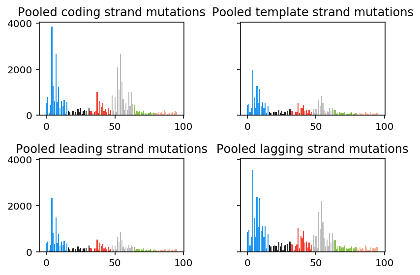
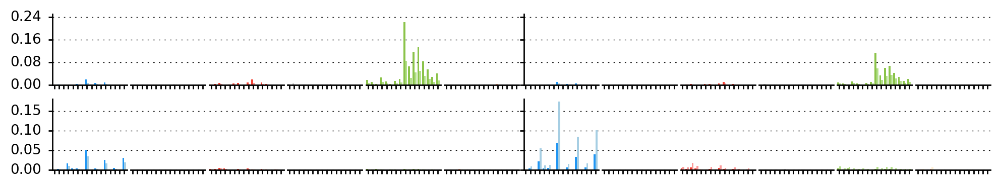
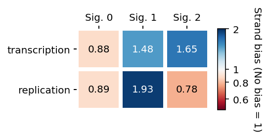
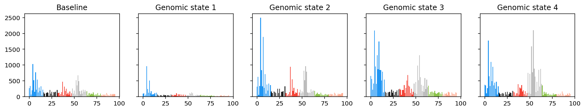
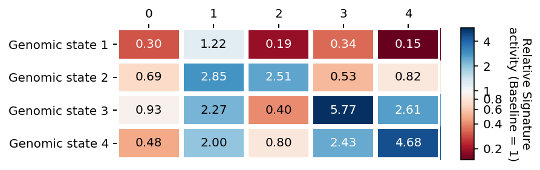
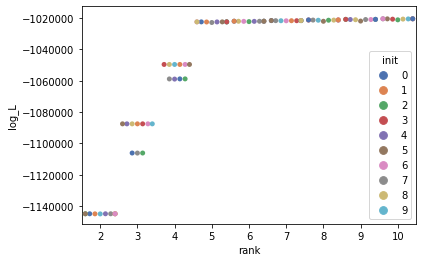
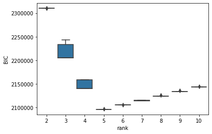
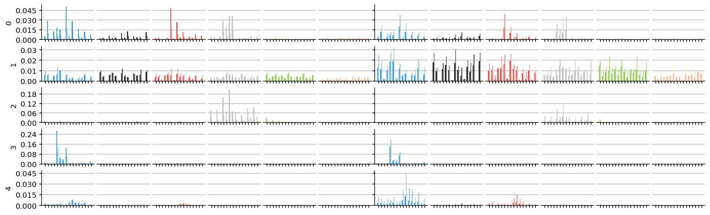
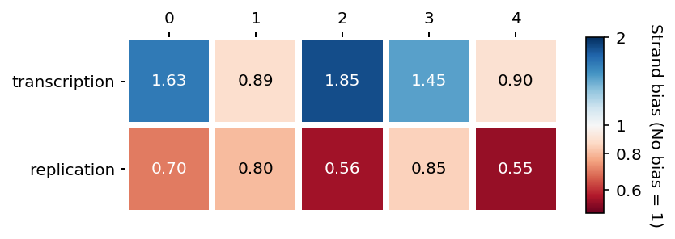

=========
Tutorials
=========

TensorSignatures extracts mutational signatures and their genomic properties from a mutation count tensor that partitions single base substitutions with respect to a multitude of genomic states. Moreover, the algorithm links other variant types to these signatures by taking into ac- count a secondary mutation matrix. In following tutorials, we want to convey an intuition for working with such highdimensional data, and explain the usage of the :code:`tensorsignatures` API and command line interface (CLI).

Understanding the SNV count tensor
==================================

Let us start by creating a simulated mutation count tensor to better understand the structure of this data type. The data module of :code:`tensorsignatures` provides a :code:`TensorSignatureData` class which allows us to simulate such data. To do so, we import the package and create a TensorSignatureData instance.

>>> import tensorsignatures as ts 
>>> data = ts.TensorSignatureData(
   seed=573, # set a seed for reproducibility
   rank=5, # number of signatures
   samples=100, # number of samples
   dimensions=[3, 5], # number of arbitrary genomic dimensions
   mutations=1000)

This command generates data from five signatures (:code:`rank`) to simulate 100 genomes (:code:`samples`) each with 1000 mutations (code:`mutations`). By passing the list [3, 5] to the :code:`dimensions` argument, we create two additional genomic dimensions1 with 3 and 5 states respectively. To obtain the SNV count tensor, we invoke the snv method of data, which returns the single base substitution count tensor.

>>> snv = data.snv()

Similarly, we can extract a simulated matrix of other mutation counts by invoking the :code:`other` method.

>>> other = data.other()

The mutation count tensor is a multidimensional array with a specific structure
-------------------------------------------------------------------------------

The :code:`snv` object is simply a 6-dimensional :code:`numpy` array,

>>> snv.ndim
6

whose shape attribute is a tuple of integers indicating the size, i.e. the number of states,
of the array in each dimension.

>>> snv.shape
(3, 3, 3, 5, 96, 100)

TensorSignatures expects the structure of the count tensor to follow a specific convention: the first and second dimension (:code:`snv.shape[0]` and :code:`snv.shape[1]`) split counts by tran- scription and replication strand, following dimensions partition single base substitution by genomic factors, and the penultimate (:code:`snv.shape[-2]`) and last dimension (:code:`snv.shape[-1]`) represent substitution types and samples respectively. The following table summarises the structure of the count tensor.

+----------------------------+-----------+-----------+---------------------------+
| Dimension                  | Size      | Index     | Data                      |
+----------------------------+-----------+-----------+---------------------------+
| Transcription              | :code:`3` | :code:`0` | Coding strand mutations   |
|                            |           +-----------+---------------------------+
| (:code:`snv.shape[0]`)     |           | :code:`1` | Template strand mutations |
|                            |           +-----------+---------------------------+
|                            |           | :code:`2` | Unassigned mutations      |
+----------------------------+-----------+-----------+---------------------------+
| Replication                | :code:`3` | :code:`0` | Leading strand mutations  |
|                            |           +-----------+---------------------------+
| (:code:`snv.shape[1]`)     |           | :code:`1` | Lagging strand mutations  |
|                            |           +-----------+---------------------------+
|                            |           | :code:`2` | Unassigned mutations      |
+----------------------------+-----------+-----------+---------------------------+
| First aribtrary genomic    |:code:`t+1`| :code:`0` | Unassigned mutations      |
| dimension                  |           +-----------+---------------------------+
|                            |           | :code:`1` | Genomic state 1 mutations |
| (eg. epigenetic states)    |           +-----------+---------------------------+
|                            |           | ...       |                           |
|                            |           +-----------+---------------------------+
| (:code:`snv.shape[2]`)     |           | :code:`t` | Genomic state t mutations |
+----------------------------+-----------+-----------+---------------------------+
| Last arbitrary genomic     |:code:`r+1`| :code:`0` | Unassigned mutations      |
| dimension                  |           +-----------+---------------------------+
|                            |           | :code:`1` | Genomic state 1 mutations |
| (eg. nucleosomal states)   |           +-----------+---------------------------+
|                            |           | ...       |                           |
|                            |           +-----------+---------------------------+
| (:code:`snv.shape[-3]`)    |           | :code:`r` | Genomic state r mutations |
+----------------------------+-----------+-----------+---------------------------+
| Base substitution types    | p=        | :code:`0` | A[C>A]A                   |
|                            | :code:`96`+-----------+---------------------------+
| (:code:`snv.shape[-2]`)    |           | :code:`1` | A[C>A]C                   |
|                            |           +-----------+---------------------------+
|                            |           | ...       |                           |
|                            |           +-----------+---------------------------+
|                            |           | :code:`p` | T[T>C]T                   |
+----------------------------+-----------+-----------+---------------------------+
| Samples                    | :code:`n` | :code:`0` | Sample 1                  |
|                            |           +-----------+---------------------------+
| (:code:`snv.shape[-1]`)    |           | ...       |                           |
|                            |           +-----------+---------------------------+
|                            |           | :code:`n` | Sample n                  |
+----------------------------+-----------+-----------+---------------------------+

Extracting the single base substutions from specific genomic states
-------------------------------------------------------------------

We index the SNV tensor like any other :code:`numpy` array. For example, to obtain variants from template and leading strands, and from the “unassigned” state of additional genomic dimensions, we simply index the tensor with :code:`snv[0, 1, 0, 0, :, :]` which returns a two dimensional array with mutation types along the first axis and samples along the other.

>>> slice = snv[0, 1, 0, 0, :, :]
>>> slice.shape
(96, 100)

Note, that we can reconstruct the :math:`p\times n` mutation count matrix, which usually serves as an input for conventional mutational signature analysis, by summing over all dimensions except the last two (representing single base substitution types and samples respectively). The following code illustrates this operation.

>>> collapsed = snv.sum(axis=(0,1,2,3,)) 
>>> collapsed.shape
(96, 100)

Another useful technique is to first index a specific state, and then to sum over all other dimensions to exclude. This allows us to extract the spectra from specific genomic states, for example, to extract all coding and template strand mutations from the tensor we would simply run

>>> coding = snv[0].sum(axis=(0,1,2,4))
>>> template = snv[1].sum(axis=(0,1,2,4))

of course this also works for any other dimension, for example, leading and lagging strand mutations maybe extracted as follows.

>>> leading = snv[:,0].sum(axis=(0,1,2,4)) 
>>> lagging = snv[:,1].sum(axis=(0,1,2,4))

To understand how they differ we may plot them,

>>> fig, axes = plt.subplots(2, 2, sharey=True)
>>> axes[0, 0].bar(np.arange(96), coding, color=ts.DARK_PALETTE)
>>> axes[0, 0].set_title("Pooled coding strand mutations")
>>> axes[0, 1].bar(np.arange(96), template, color=ts.DARK_PALETTE) > axes[0, 1].set_title("Pooled template strand mutations")
>>> axes[1, 0].bar(np.arange(96), leading, color=ts.DARK_PALETTE) > axes[1, 0].set_title("Pooled leading strand mutations")
>>> axes[1, 1].bar(np.arange(96), lagging, color=ts.DARK_PALETTE) > axes[1, 1].set_title("Pooled lagging strand mutations")
>>> plt.tight_layout()

which reveals that some variant types, e.g. C>A (blue), C>T (red) and T>A (grey), seem to occur with different frequencies across transcription and replication states.

By indexing the SNV tensor appropriately, we can also recover mutational spectra from different state combinations, eg. :code:`snv[0,:,2].sum(axis=(0,1))` would return a :math:`p \times n` matrix representing the coding strand mutations in state 2 of the first additional genomic dimension.

To summarize, in this section we created a simulated SNV tensor using the :obj:`TensorSignatureData` class. TensorSignatures features the characterization of mutational processes across an arbitrary number of genomic dimensions and states, but requires the user structure their input array in specified manner. The SNV count tensor must contain transcriptional and replicational variants in the first two dimension, and specify base substitutions as well as samples in the last two dimensions. To recover mutational spectra in specific contexts, the SNV count tensor has to be indexed and summed over all remaining dimensions (except the ones containing base substitutions and samples).

Understanding tensor factors
============================

In the previous section, we created a simulated dataset using the :code:`TensorSignaturesData` class, and investigated the data by plotting mutational spectra in various genomic contexts. While doing so, we discovered that some variant types occur with different frequencies in different genomic states, for example, frequencies of coding strand C>A, C>T and T>A variants seemed to be twice as large in comparison to corresponding numbers on template strand DNA. Strand asymmetries have been observed for several mutational processes and are often attributed to DNA repair mechanisms. Transcription coupled repair (TCR), for example, actively depletes mutations on template strand DNA in gene encoding regions.

Transcriptional and replicational biases
----------------------------------------

TensorSignatures models variability in mutagenesis due to transcription and replication by

1. extracting separate single base substitution spectra for coding and template strand, and leading and lagging strand DNA
2. fitting a scalar for each signature in context of transcription and replication that quantifies the overall strand asymmetry of single base substitutions (bias matrix :code:`b`)
3. fitting a scalar for each signature that is interpreted as the relative signature activity of signature in transcribed vs untranscribed regions, and early and late replicating regions (activity matrix :code:`a`).

To understand this better, let us first plot the signatures that were used to simulate the counts in data.

>>> plt.figure(figsize=(16, 5))
>>> ts.plot_signatures(data.S.reshape(3, 3, -1, 96, data.rank))

This reveals the SNV spectra (rows) in context of transcription and replication in the left and right column. Colors indicate the mutation type (blue C>A, black C>G, red C>T, grey T>A, green T>C and salmon T>G), while the shading indicates the mutation type probabilities for coding strand and leading strand DNA (dark), and for template and lagging strand DNA (light), respectively. Notice, for example, how in the fourth signature (last row), the amplitude of dark and light grey bars differ, indicating that this mutational process is more likely to produce T>A mutations on coding and leading strand DNA respectively.

TensorSignatures models the propensity of a mutational process to generate strand specific mutations by scaling the SNV spectra for coding and template, and leading and lagging strand with a multiplicative scalar variable. To visualise the strand biases for our simulated dataset, we pass the strand biases, accessible via the b attribute of our data object, to the ts.heatmap function.

>>> plt.figure(figsize=(6,2)) 
>>> ts.heatmap(
   data.b, 
   vmin=.5, vmax=2, # allows to specify the limits of the colorbar 
   row_labels=["transcription", "replication"],
   cbarlabel="Strand bias (No bias = 1)") # color bar label

Rows of the heat map depict the context and columns signatures. Note the logarithmic scaling of the color bar, which indicates that a baseline value of 1 resembles a mutational process with no strand preference. Coefficients < 1 (red) indicate signature enrichment on template or lagging strand DNA, and conversely, values > 1 (blue), an asymmetry towards the on coding or leading strand.

Signature activities in specific genomic regions
------------------------------------------------

The multidimensional representation of SNV count data allows TensorSignatures to quantify the propensity of mutational processes within confined genomic regions. These genomic contexts, thereafter also genomic states, may represent genomic features such as specific chromatin marks or nucleosome occupancy. To illustrate this, we depicted a genomic region in the following figyre together with arbitrary genomic states and respective mutations.

.. figure::  images/genomic_states.png
   :align:   center
   
   *The distribution of single base substitutions may vary due to differences in genome organisation and other factors. The horizontal bar plot in the upper panel depicts genomic states, which represent confined genomic regions with certain features. The rainfall plot underneath shows the variant types at these genomic loci.*

The rainfall plot representation may not always reveal changes in the mutational spectrum on first sight. However, the SNV count tensor contains the mutational spectra of each state combination. We can inspect them by indexing the respective state and summing over all remaining dimensions except the one for trinucleotides. To visualize, for example, pooled mutation spectra along the five states of the fourth dimension in our simulated dataset we would execute the following code.

>>> fig, ax = plt.subplots(1, 5, figsize=(16, 2.5), sharey=True) 
>>> ax[0].bar(np.arange(96), snv[:,:,:,0].sum(axis=(0,1,2,4)), color=ts.DARK_PALETTE)
>>> ax[0].set_title("Baseline")
>>> ax[1].bar(np.arange(96), snv[:,:,:,1].sum(axis=(0,1,2,4)), color=ts.DARK_PALETTE)
>>> ax[1].set_title("Genomic state 1")
>>> ax[2].bar(np.arange(96), snv[:,:,:,2].sum(axis=(0,1,2,4)), color=ts.DARK_PALETTE)
>>> ax[2].set_title("Genomic state 2")
>>> ax[3].bar(np.arange(96), snv[:,:,:,3].sum(axis=(0,1,2,4)), color=ts.DARK_PALETTE)
>>> ax[3].set_title("Genomic state 3")
>>> ax[4].bar(np.arange(96), snv[:,:,:,4].sum(axis=(0,1,2,4)), color=ts.DARK_PALETTE)
>>> ax[4].set_title("Genomic state 4")

This plot nicely illustrates that different genomic states may have a variable exposure to different mutational signatures. For example, judging from the prevalence of C>A and T>A variants in genomic state 2 and 4, it appears likely that these states are dominated by signature 3 and 4 respectively. TensorSignatures models the activity of each signature by fitting a single coefficient for each signature and genomic state. To visualize the coefficients used to generate our simulated dataset we execute

>>> plt.figure(figsize=(6,2)) 
>>> ts.heatmap(
   data.k1,
   row_labels=["Genomic state 1", . . ., "Genomic state 4"], 
   col_labels=["{}".format(i) for i in range(5)], 
   cbarlabel="Relative Signature\nactivity (Baseline = 1)")

which confirms our suspicion about the elevated activities of signature 3 and 4 in genomic state 3 and 4 respectively. To interprete this correctly, keep in mind that usually majority of SNVs do not fall into specific genomic states and therefore end up in the baseline or "unassigned" state, which is in TensorSignatures always 1, and to which all other coefficients are inferred relatively to. In other words, signature 3, for example, shows 5.77 times higher activities in genomic state 3 in comparison to the genomic baseline.

The TensorSignatures CLI
========================

The TensorSignatures CLI comes with six subroutines,

* :code:`boot`: computes bootstrap intervals for a TensorSignature initialisation,
* :code:`data`: simulates mutation count data for a TensorSignature inference,
* :code:`prep`: computes a normalisation constant and formats a count tensor,
* :code:`refit`: refits the exposures to set of fixed tensor signatures, 
* :code:`train`: runs a denovo extraction of tensor signatures,
* :code:`write`: creates a hdf5 file out of dumped tensor signatures pkls.

The goal of this tutorial is to illustrate how to run TensorSignatures in a practical setting. For this reason we will first simulate mutation count data using :code:`tensorsignatures data`, and subsequently run :code:`tensorsignatures train` to extract constituent signatures. In the next section we will then analyse the results of this experiment in jupyter with help of the :code:`tensorsignatures` API.

Simulate data via the CLI
-------------------------

To create a reproducible (the first positional argument sets a seed: 573) synthetic dataset from 5 mutational signatures (second positional argument) with the CLI, we invoke the data subprogram

::
    
   $ tensorsignatures data 573 5 data.h5 -s 100 -m 10000 -d 4 -d 5

which will simulate 100 samples (:code:`-s 100`) each with 10,000 mutations (:code:`-m 10000`), and two additional genomic dimensions with 3 and 5 states (:code:`-d 3 -d 5`) respectively. The program writes a :code:`hdf5` file :code:`data.h5` to the current folder containing the datasets :code:`SNV` and :code:`OTHER` representing the SNV count tensor and all other variants respectively.

Running TensorSignatures using the CLI
--------------------------------------

Since we know the number of signatures that made up the dataset we can run a TensorSignatures decomposition simply by executing

::
    
   $ tensorsignatures --verbose train data.h5 my_first_run.pkl 5

which saves a pickle able binary file to the disk, which we can load into a interactive python session (eg. a Jupyter notebook) for further investigation.

>>> init = ts.load_dump("my_first_run.pkl") 
>>> init.S.shape
(3, 3, 3, 5, 96, 5, 1)

However, usually we do not know the number of active mutational processes a priori. For this reason, it is necessary to run the algorithm using different decomposition ranks, and to subsequently select the most appropriate model for the data. Moreover, we recommend to run several initialisations of the algorithm at each decomposition rank. This is necessary, because non-negative matrix factorisation produces stochastic solutions, i.e. each decomposition represents a local minimum of the objective function that is used to train the model. As a result, it is worthwhile to sample the solution space thoroughly, and to pick the solution which maximised the log-likelihood. Running TensorSignatures at different decomposition ranks while computing several initialisations is easy using the CLI. For example, to compute decompositions from rank 2 to 10 with 10 initialisation each, we would simply write a nested bash loop.

::
   
   $ for rank in {2..10}; do
   $   for init in {0..9}; do
   $     tensorsignatures train data.h5 sol_${rank}_${init}.pkl ${rank} -i ${init} -j MyFirstExperiment; $ done;
   $   done;
   $ done;

Also note the additional arguments we pass here to the programme; the :code:`-i` argument identifies each initialisation uniquely (mandatory), and the :code:`-j` parameter allows us to name the experiment, which in this context denotes multiple TensorSignature decompositions across a range of ranks extracted using the same hyper parameters (number of epochs, dispersion, etc).

Summarising the results from many initialisation with :code:`tensorsignatures write`
------------------------------------------------------------------------------------

This command produces for each rank (2-10) ten initialisation and saves the results as pickleable binary files to the hard disk. Loading the 9 x 10 initialisations manually using :code:`ts.load_dump` would be quite tedious and even impracticable in larger experiments. For this reason, we included the subprogram :code:`tensorsignatures write`, which takes a :code:`glob` filename pattern and an output filename as arguments to generate a :code:`hdf5` file containing all initialisations.

::
   
   $ tensorsignatures write "sol_*.pkl" results.h5

The TensorSignatures API
========================

The TensorSignatures API provides useful functions to analyse results from TensorSignature decompositions. Since running the tool usually involves creating several initialisations at different decomposition ranks, we provide three classes that abstract

* Experiments (:code:`Experiment`), i.e. multiple initialisation at different decomposition ranks extracted using the same hyper parameters,
* Cluster (:code:`Cluster`), i.e. multiple initialisations at a specific decomposition rank,
* Initialisations (:code:`Initialization`): a single decomposition.

Importing data and performing model selection using the :code:`Experiment` class
--------------------------------------------------------------------------------

The :code:`Experiment` class loads and clusters initialisations of each decomposition rank of a :code:`hdf5` file written by :code:`tensorsignatures write` (previous section)

>>> experiment = ts.Experiment("results.h5")

The :code:`data` field of an Experiment instance returns a set of keys, which allow us to access the :code:`Cluster` of the experiment. Keys follow the format to prefix the decomposition rank with the name of the experiment, which we set earlier using the :code:`-j` flag when we ran :code:`tensorsignatures train`.

>>> experiment.data
{"/MyFirstExperiment/10", "/MyFirstExperiment/2", ..., "/MyFirstExperiment/9"}

The :code:`Experiment` class computes a table of useful statistics,

>>> experiment.summary_table.head()

which, for example, enable us to inspect log likelihood of each initialisation (Here we use the the :code:`seaborn` library to create the plot, you can install the package, if necessary, by executing :code:`pip install seaborn` in your terminal),

>>> sns.swarmplot(x="rank", y="log_L", hue="init", data=experiment.summary_table, color="C0", palette="deep")

The :code:`summary_table` also allows us to perform model selection using the Bayesian Information Criterion (BIC). This estimator tries to find a trade-off between the log-likelihood and the number of parameters in the model; chosen is the rank which minimises the BIC. To understand which model to choose in our experiment, we will quickly plot the rank against BIC,

>>> import seaborn as sns
>>> sns.boxplot(x="rank", y="BIC", data=experiment.summary_table, color="C0")

indicating that rank 5 is most appropriate for our dataset.

The :code:`Cluster` class wraps multiple TensorSignature initialisations
------------------------------------------------------------------------

We can extract the cluster of a specific decomposition rank by passing these keys to the getter function of an :code:`Experiment` object. For example, to extract the rank 5 solution, we execute

>>> cluster = experiment["/MyFirstExperiment/5"]

A :code:`Cluster` instance is essentially a wrapper for multiple :code:`Initializations`. It embodies attributes to access the parameters of a tensor signature inference, for example, we may access the extracted signature tensor(s) through the :code:`S` field of :code:`Cluster`.

>>> cluster.S.shape
(3, 3, 3, 5, 96, 5, 10)

Note the similarity between the shape of the extracted signature tensor and the shape of the input :code:`snv` count tensor (:code:`(3, 3, 3, 5, 96, 100)`). First few indices match the size of corresponding genomic dimensions, i.e. transcription and replication directionality (each :code:`3`), genomic dimension 1 and 2 (:code:`3` and :code:`5`) and single base substitution types (:code:`96`). The following two indices, however, indicate the decomposition rank (:code:`5`) rather than the number of samples, and the number initialisations in the cluster.

Other model parameters may be accessed through the following fields:

* Other mutation type signatures: :code:`result.T`
* Exposures: :code:`result.E`
* Transcription and replicational strand biases: :code:`result.b`
* Signature activities in transcribed/untranscribed regions and early/late replicating regions: :code:`result.a`
* Arbitrary genomic property(like epigenetic signature activities): :code:`result.k0`, :code:`result.k1`, ..., :code:`result.kx`
* Mixing proportions: :code:`result.m`

The last dimension of an extracted :code:`Cluster` parameter always indicates the number of available initialisations. To extract the solution of a particular initialisation, we can can simply index it using standard numpy indexing. Here we make use of the so called ellipsis operator (:code:`...`) which enables to index the last dimension of an multidimensional array

>>> solution = cluster.b[..., 3] 
>>> solution.shape
(2, 7)

:code:`Cluster` objects provide an init field containing the index of the initialisation with the highest log-likelihood. To extract this particular :code:`Initialization` from a cluster, we simply pass it to the :code:`Cluster` getter function.

>>> init = cluster[cluster.init]

A :code:`Initialization` object stores tensor signatures, factors and exposures
-------------------------------------------------------------------------------

Similar to TensorSignature :code:`Cluster` objects, :code:`Initializations` contain the fitted model including all parameters. For example, we can access the extracted signature tensor by accessing the :code:`S` field from :code:`init`.

>>> init.S.shape
(3, 3, 3, 5, 96, 5, 1)

Note that the last dimension of :code:`S` has a size of one, indicating an initialisation rather than a clustered signature tensor. Two other useful methods of :code:`Initialization` objects are :code:`to_dic` and :code:`dump`, which let us serialise and save the result of a TensorSignature initialisation to the hard disk.

>>> init.to_dic() # returns a dictionary with all parameters
>>> init.dump(‘initialisation.pkl’) # saves the initialisation to disk (load a saved solution with ts.load_dump)

The TensorSignatures API features some basic plotting function which allow us to visualise the extracted parameters of an :code:`Initialisation`.

* :code:`plot_signatures`: plots single base substitution spectra in context of transcription and replication
* :code:`heatmap`: plots tensor factors (transcription and replication biases (:code:`b`), signature activities (:code:`a`), and genomic activities (:code:`k0`, :code:`k1`, ... , :code:`kx`))

The :code:`plot_signatures` function expects an 5 dimensional array (:code:`(3, 3, -1, 96, rank)`). Due to the fact that we can have an arbitrary number of genomic states, we first have to reshape the signature tensor before we can pass it to the plotting function.

>>> plt.figure(figsize=(16, 5))
>>> ts.plot_signatures(init.S.reshape(3, 3, -1, 96, init.rank))

We can plot extracted tensor factors :code:`result.b`, :code:`result.a`, :code:`result.k0` and :code:`result.k1` using the :code:`ts.heatmap` function. Note, that similarly to the signature tensor, the :code:`Initialization` object appends an additional dimension to indicate its index. For this reason, we need to reshape the arrays containing tensor factors or index them appropriately.

>>> result.b.shape # transcription and replication strand biases
(2, 5, 1)
>>> # ... (the elipsis operator) allows to index the last dimension of an array > plt.figure(figsize=(6,2))
>>> ts.heatmap(result.b[..., 0],
   vmin=.5, vmax=2,
   row_labels=[’transcription’, ’replication’], col_labels=[’{}’.format(i) for i in range(5)], cbarlabel=’Strand bias (No bias = 1)’ # color bar label
   )

Running TensorSignatures through the API
----------------------------------------

In some scenarios it might be desirable to run TensorSignatures via the API rather than the CLI (for example when integrating TensorSignatures into custom pipelines). To illustrate this, we first simulate data and extract the SNV count tensor and the matrix containing other mutation types. Here it is important to notice that the sample dimensions have to match, e.g. :code:`snv[..., 4]` has to match :code:`other[..., 4]`.

>>> data = ts.TensorSignatureData(
   seed=573, # set a seed for reproducibility
   rank=5, # number of signatures
   samples=100, # number of samples
   dimensions=[3, 5], # number of arbitrary genomic dimensions mutations=1000)
>>> snv = data_set.snv() # the SNV count tensor (3, 3, 3, 5, 96, 100) 
>>> other = data_set.other() # other mutation type matrix (234, 100)

The next step is to pass the desired decomposition rank, as well as the input data, i.e. the :code:`snv` count tensor and the other mutation matrix, to the :code:`TensorSignature` class (When working with real genomic data it is also necessary to pass a normalisation tensor (via the argument :code:`N`) which accounts for differences in the nucleotide composition of different genomic regions to the TensorSignature constructor.). The :code:`TensorSignature` constructor also receives other model hyperparameters such as learning rate of the model or the number of epochs to train the model. By default, TensorSignatures uses the outlier robust negative binomial distribution with a dispersion :math:`\tau = 50` to model the mutation count, and trains the model for 10,000 epochs.

>>> model = ts.TensorSignature(snv, other, rank=5, verbose=True, epochs=20000) # perform a rank 5 decomposition

To fit the signatures to our data, we simply invoke the :code:`fit` method of the model instance, which will return a :code:`ts.Initialization` object after finishing to train the model.

>>> result = model.fit()